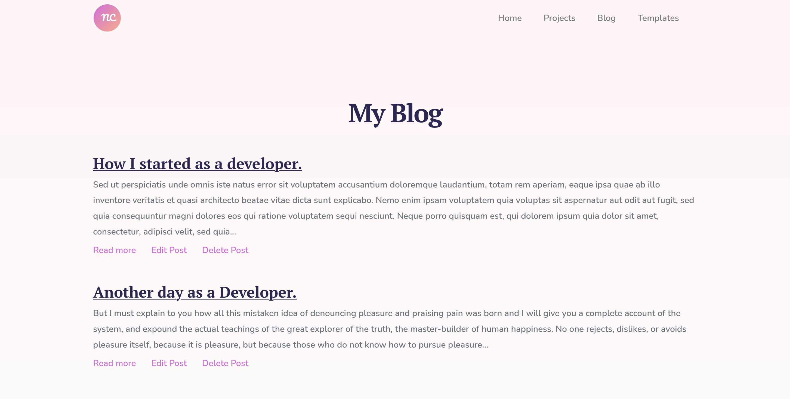

# My Dev Thoughts.

Describe why you came up with this project.

## Project live demo
[Live demo]()

## About the project.
- 

## Project Requirements
- 

## How to run this project

- Install Ruby.
- Install Ruby on Rails.
- Install bundle.
- Run "bundle install" inside the project  folder.
- Run "rails server" inside the project folder.
- Go to "https://localhost:3000/"

## Technologies Used
- Ruby on Rails
- HTML5
- CSS3
- RSpec
- Bootstrap 4.5

## Test-driven development RSPEC

The code includes unit testing using RSpec. To start the test run `bundle exec rspec` in your terminal:

## Author

**Nakitto Catherine**
- Linkedin: [Nakitto Catherine](https://www.linkedin.com/in/nakitt-catherine2020)
- Github: [@Cathella](https://github.com/Cathella)
- Twitter: [@cathella9](https://twitter.com/cathella9)

## Show your support

Give a ⭐️ if you like this project!

## Enjoy!
